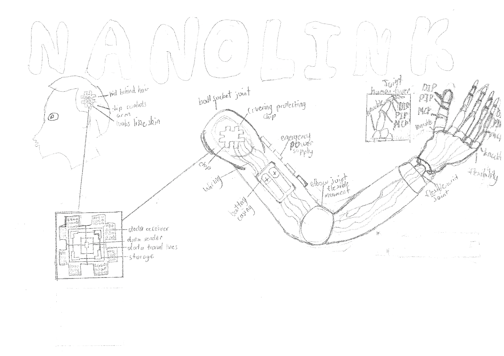

# Vladimir.G_Zaif.K_Neuro_Grip

<h1> High Level Pictorials</h1>

<h2> Project Overview</h2>
<h3> Our project is the design on a bionic arm labelled NeuroGrp for a biomendical purpose. The arm is highly functional in maintaining stability and accuracy for different tasks that our patient Aaron can do. Aaron needs a sport-prosthetic along with an arm that helps him complete daily activities. The arm, consists of a- look alike of a human arm just developed from silicone and is lightweight and durable. The prosthetic's components will interact cohesively to enhance Aaron’s experience. The control module will connect with the adaptable grip for real-time feedback, ensuring stability during climbs. Modular parts will be easy to interchange, creating a seamless experience whether he is climbing or performing daily tasks. This design will empower Aaron to reconnect with his passions, helping him live an active, fulfilling life with technology that supports his confidence and functionality.   </h3>

<h2>Components</h2>
[^1]: 3 Servos
[^2]: 1 Ultrasonic Sensor
[^3]: (Buzzer Sensor)

<h2> Challenges</h2>
<h3> We both experienced difficulties in coding and devleoping the arm, first of all we had to get the servos and ultrasonic sensor to work and detect stimuli in the surrounding environment. The main problem we experienced was the sensors not behaving the way that it was intended too as the project will combine various sensors in order to get the arm to work. Sometimes there would be errors in setting up the Arduino. </h3>